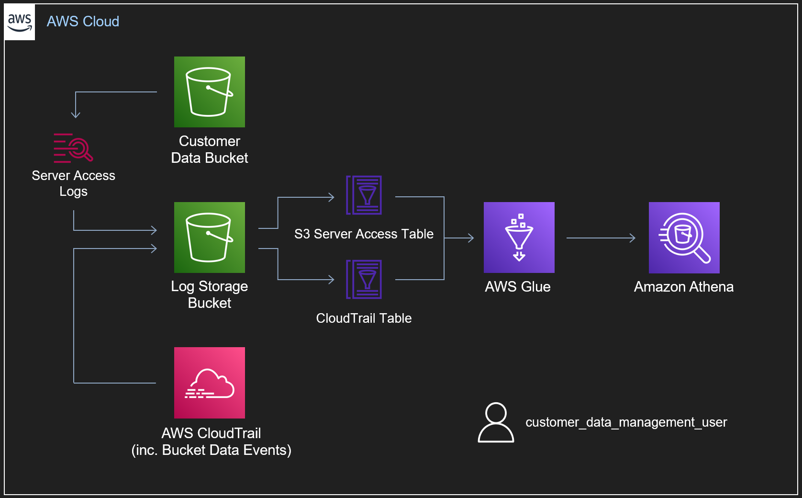

# F-Secure Attack Detection Fundamentals 2021 Workshop - AWS
## Lab Environment

This repo provides the Terraform scripts required to deploy the lab environment used across the AWS attack detection workshop lab exercises. 

>NOTE: This lab environment includes a misconfigured IAM user, by design. As such, it should only be deployed in a test account.

As discussed in the [workshop](https://www.f-secure.com/gb-en/consulting/events/attack-detection-fundamentals-workshops-2021), the primary components of the environment can be seen below.




Within our lab environment, we have two buckets:

- Our 'Customer Data' bucket
- Our 'Log Storage' bucket

For the purposes of this lab, our 'Customer Data' bucket has Server Access Logging enabled, as well as Data Events going into a CloudTrail log. Both of these log sources are being stored in our 'Log Storage' bucket. Notably, in a 'real' logging setup, we likely wouldn't enable both Server Access Logging and Data Events as they provide much of the same information (as we'll see in a subsequent lab). Simarily, it's considered best practice to forward our logs outside of the account to a centralised security or logging account, preventing an attacker destroying evidence in the event our account is compromised - as it's about to be!

To query the two telemetry sources, we've defined schemas for both using the AWS Glue Data Catalog. From here, we can use Athena to make SQL queries against the data in our S3 Log Storage bucket.

Finally, our Terraform script will provision a user, "customer_data_management_user" with the following inline JSON policy.

```
{
  "Version": "2012-10-17",
  "Statement": [
    {
      "Action": [ "s3:GetObject" ],
      "Effect": "Allow",
      "Resource": "${aws_s3_bucket.bucket_for_exfil.arn}/*"
    },
    {
      "Action": [ "s3:ListBucket" ],
      "Effect": "Allow",
      "Resource": "${aws_s3_bucket.bucket_for_exfil.arn}"
    },
    {
      "Action": [
        "s3:ListAllMyBuckets",
        "iam:*"   
      ],
      "Effect": "Allow",
      "Resource": "*"
    }
  ]
}
```

This policy provides our user with several privileges:
- They can list all buckets in the account.
- They can list the contents of only the 'Customer Data' bucket.
- They can download the objects from only the above bucket.
- They have unrestricted IAM privileges.

For those with even the most foundational knowledge of AWS, that last privilege should be ringing alarm bells! This `customer_data_management_user` has the ability to view, create, modify and delete all users and privileges within the account. They're effectively an API call or two away from full control of the account. 

## Install

Having [installed]((https://www.terraform.io/downloads.html)) and [configured](https://learn.hashicorp.com/tutorials/terraform/aws-build?in=terraform/aws-get-started) Terraform (we're using version 0.14.10 specifically), we can run the following commands.
```
terraform init
terraform plan
terraform apply
```
On successful deployment, you will be presented with the AWS access key with which to perform the lab exercises. 

When you're done, the whole environment can be torn down with the following command:
```
terraform destroy
```